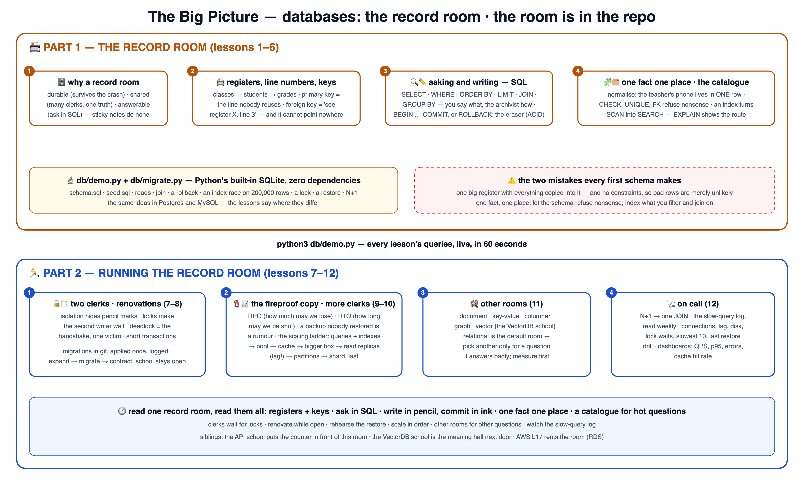

# 🗄️ Learn Databases the School Way — the record room

The school method — proven on
[AWS](https://github.com/BaluRaut/learn-aws-school),
[Kubernetes](https://github.com/BaluRaut/learn-kubernetes-school),
[APIs](https://github.com/BaluRaut/learn-api-school) and the rest of
[The School](https://baluraut.github.io/school/) — applied to **databases**: where
the school keeps its truth, taught as the **record room** — registers with line
numbers, a ledger in pencil, a card catalogue, a fireproof copy.

What makes this course different: **the record room is IN the repo.** A real SQLite
database built by Python's built-in `sqlite3` — zero dependencies, no server to
install — that every lesson queries, breaks and repairs.

🌐 **Interactive site:** **<https://baluraut.github.io/learn-database-school/>** —
lesson cards, every lesson as a numbered diagram, the big-picture 4K, a quiz, a
study plan and the before-and-trade-offs page.

> 🎒 **Prerequisites:** Python 3. Nothing else. Good neighbours: the
> [API school](https://github.com/BaluRaut/learn-api-school) (the counter in front of
> this room), the [VectorDB school](https://github.com/BaluRaut/learn-vectordb-school)
> (the meaning hall next door) and the AWS school's RDS lesson (renting the room).

## 🚀 The 60-second wow

```bash
python3 db/demo.py        # builds school.db, then: reads, a JOIN, a rollback, a constraint refusal,
                          # an index race on 200,000 rows, a lock between two clerks, a restore, an N+1
python3 db/migrate.py     # renovates the room: three migrations, applied once each, logged
```

## 🗺️ The big picture



## 🎓 The 12 lessons

Each numbered branch adds ONE lesson folder (`lessons/NN-topic/README.md`) with an
explain-like-I'm-5 story, a school analogy, a diagram, **What / Why / How**, a
hands-on lab on the real database, and Verify / Clean-up / Common-mistakes sections.
Branches are **sequential** — branch 07 contains lessons 01–07.

```bash
git checkout lesson-01-why-databases     # read lessons/01-why-databases/README.md, then...
git checkout lesson-02-tables-rows-keys  # ...keep going, one branch at a time
```

### Part 1 — the record room 📇

| # | Branch | You learn | Analogy |
|---|---|---|---|
| 01 | `lesson-01-why-databases` | Durable, shared, answerable — vs files and spreadsheets | The record room vs sticky notes 🗄️ |
| 02 | `lesson-02-tables-rows-keys` | Tables, rows, primary and foreign keys | Registers with line numbers 📇 |
| 03 | `lesson-03-sql-reads` | SELECT, WHERE, ORDER BY, LIMIT, JOIN, GROUP BY | Asking the archivist 🔍 |
| 04 | `lesson-04-transactions` | INSERT/UPDATE/DELETE, BEGIN/COMMIT/ROLLBACK, ACID | The ledger in pencil ✏️ |
| 05 | `lesson-05-data-modelling` | Normalisation, constraints, deliberate denormalisation | One fact, one place 🧩 |
| 06 | `lesson-06-indexes` | B-trees, EXPLAIN, when an index hurts | The card catalogue 🗂️ |

### Part 2 — running it 🏃

| # | Branch | You learn | Analogy |
|---|---|---|---|
| 07 | `lesson-07-concurrency` | Locks, isolation levels, deadlocks | Two clerks, one register 🔒 |
| 08 | `lesson-08-migrations` | Versioned scripts, expand/contract, the logbook | Renovating while school is open 🏗️ |
| 09 | `lesson-09-backups-recovery` | RPO, RTO, point-in-time, the restore drill | The fireproof copy 🧯 |
| 10 | `lesson-10-scaling` | Pools, caches, replicas, partitions, sharding — in order | More clerks, more rooms 📈 |
| 11 | `lesson-11-nosql-other-rooms` | Document, key-value, columnar, graph, vector | Choosing the room for the question 🏘️ |
| 12 | `lesson-12-performance-ops` | N+1, slow-query log, the on-call checklist | The record room on call 🩺 |

## 📦 What's in this repo (main branch)

```
learn-database-school/
├── db/
│   ├── schema.sql            # the registers: classes, students, grades, homework — with keys and constraints
│   ├── seed.sql              # five students, ten grades
│   ├── demo.py               # every lesson's queries, live (sections: reads join txn model index locks backup nplus1)
│   ├── migrate.py            # applies db/migrations/*.sql once each, logged in schema_migrations
│   └── migrations/           # 001_init · 002_add_house · 003_index_grades_subject
└── docs/                     # the GitHub Pages site
```

Everything runs on your laptop with Python's built-in SQLite. **Cost: zero.**

## 📜 License

MIT — see [LICENSE](LICENSE). Analogies are free to reuse; attribution appreciated.
