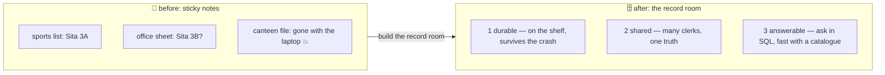

# 🗄️ Lesson 01 — Why databases: the record room

**📍 You are here:** Lesson **01** of 12 · Next: `lesson-02-tables-rows-keys`

---

## 📦 What's in this branch

The problem databases exist to solve — and the three promises (**durable,
shared, answerable**) that explain every design choice in the rest of the
course. Real files you will use all the way through:

- [db/schema.sql](../../db/schema.sql) — the registers, drawn properly
- [db/seed.sql](../../db/seed.sql) — five students, ten grades
- [db/demo.py](../../db/demo.py) — every lesson's queries, live, on a real SQLite database

> 🎒 **Before you start:** you need **Python 3** — its built-in `sqlite3`
> module is the whole record room; no server, no Docker, no cloud. The
> ideas are the same in Postgres and MySQL; the lessons say where they
> differ. Good neighbours: the
> [API school](https://baluraut.github.io/learn-api-school/) (the counter
> in front of this room) and the
> [VectorDB school](https://baluraut.github.io/learn-vectordb-school/)
> (the meaning hall next door).

## 🧒 Explain like I'm 5

Where does the school keep the truth about its students? In the bad old
days: **sticky notes and spreadsheets** 📝. The sports teacher had a
list, the office had another, the canteen app kept its own file. Three
lists, three versions of Sita's class. The office laptop died on a Friday
and took the grades with it. And nobody could answer a simple question —
"every 3A student with an A in maths" — without opening three files and
a calculator.

So the school built a **record room** 🗄️: one place, run by an archivist,
with three promises:

1. **Durable** — written into bound registers on the shelf, not on a
   sticky note. The laptop dies; the registers stay.
2. **Shared** — every clerk, app and teacher consults the *same*
   registers, and the archivist makes sure two clerks writing at once do
   not tear a page (lesson 07).
3. **Answerable** — you ask a question in a standard way ("every 3A
   student with an A in maths") and the archivist finds it — quickly,
   with a card catalogue (lesson 06).

That record room is a **database**. The registers are **tables**, the
question language is **SQL**, and the archivist is the database engine.

## 🗺️ Diagram



## ❓ What

- A **database** is a program that keeps data durable, lets many users
  read and write it safely, and answers queries. SQLite (this course),
  Postgres and MySQL are relational databases: data in tables with keys.
- **Durable** = a committed write survives a crash (lesson 04's ACID).
- **Shared** = concurrent access with locks and isolation (lesson 07).
- **Answerable** = a query language plus indexes (lessons 03, 06).
- Behind every counter of the API school is one of these rooms; the
  counter keeps visitors out of the room, and the room keeps the truth.

## 🤔 Why

Because "just keep it in a file" fails on all three promises at once, and
each failure is expensive: lost data, two versions of the truth, and
questions nobody can answer. Every scaling, backup and modelling lesson
that follows is one of the three promises kept under pressure.

## 🔧 How (in this repo)

`python3 db/demo.py` builds `db/school.db` from `schema.sql` + `seed.sql`
and runs every section of the course. Today you only run it and read.

## 🧪 Try it (60 seconds — the whole course, live)

```bash
python3 db/demo.py
```

You should see, trimmed:

```text
🗄️  school.db built from schema.sql + seed.sql
═══ reads ═══   ('Aarav', '3A-01') ('Kabir', '3A-03')
═══ join ═══    ('Aarav', '3A', 'maths', 'A') …
═══ txn ═══     💥 second update failed: FOREIGN KEY constraint failed → ROLLBACK
═══ index ═══   without an index: SCAN … 2.4 ms · with the card catalogue: SEARCH … 0.0 ms
═══ locks ═══   ⏳ clerk 1 waited, then: database is locked
═══ backup ═══  after the restore — Rohan returns
✅ done — the record room survived every lesson
```

## ✅ Verify — what you should see

The script ends with `✅ done`; `db/school.db` exists (`ls -la db/`); running it again rebuilds the room from scratch (it deletes and recreates the file — that is on purpose while learning).

## 🏁 What you just proved

A real database needs nothing installed: one schema file, one seed file, and Python's built-in SQLite answered every question this course will teach.

## ⚠️ Common mistakes

- running from another folder — the script finds its files relative to `db/`, but run it from the repo root as shown
- editing `school.db` by hand and losing it on the next run — change `schema.sql`/`seed.sql` instead
- thinking "database" means "a big server" — SQLite runs inside your program and is the most deployed database on earth

> 🏭 **Why this matters in production:** every incident with the words "lost", "inconsistent" or "slow" in it is one of the three promises broken. Naming which one is the first step of every database conversation.

## ⏭️ Next

What exactly is a register? **Tables, rows and keys** — and why a key can
never point nowhere.

```bash
git checkout lesson-02-tables-rows-keys
```
