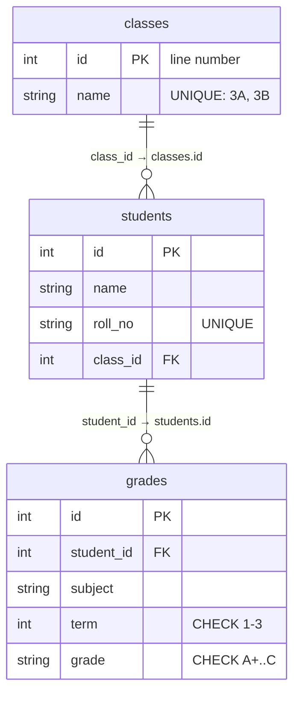

# 📇 Lesson 02 — Tables, rows & keys: registers with line numbers

**📍 You are here:** Lesson **02** of 18 · Previous: `lesson-01-why-databases` · Next: `lesson-03-sql-reads`

---

## 📦 What's in this branch

Lesson 01, **plus** the shape of the record room: **tables** (registers),
**rows** (lines), **columns** (the printed headings), **primary keys**
(line numbers) and **foreign keys** ("see register X, line 3").

## 🧒 Explain like I'm 5

Open the record room and you see three **registers** 📇:

- **classes** — one line per class: line 1 says `3A`, line 2 says `3B`.
- **students** — one line per student: name, roll number, and *which
  class* — written as "see the classes register, line 1", not as the
  word "3A" copied out.
- **grades** — one line per grade: "see students, line 2 · maths · term
  1 · A+".

The **line number** in each register is the **primary key**: it is never
reused, never changes, and is the only thing another register points at.
A pointer to another register is a **foreign key** — and the archivist
enforces a rule: **a line may not point at a line that does not exist.**
Try to write "see classes, line 99" and the pen is refused.

Every printed heading has a type (`TEXT`, `INTEGER`) and rules
(`NOT NULL`, `UNIQUE`, `CHECK`). The register itself refuses nonsense —
a duplicate roll number, a grade of `Z` — before any program has to.

## 🗺️ Diagram



## ❓ What

- **Table** = a register; **row** = one line (one thing); **column** = a
  heading with a type. One table per *kind* of thing.
- **Primary key**: a column (or set) that identifies a row uniquely and
  never changes. Integer ids are the boring, correct default; natural
  keys (roll numbers) get a `UNIQUE` constraint instead.
- **Foreign key**: a column holding another table's primary key.
  `REFERENCES classes(id)` makes the database refuse orphans.
  `ON DELETE CASCADE` on `grades` means deleting a student removes their
  grades — a decision you make per relationship, on purpose.
- **Constraints**: `NOT NULL`, `UNIQUE`, `CHECK (grade IN (...))`,
  composite `UNIQUE (student_id, subject, term)` — "one grade per student
  per subject per term" written into the shelf itself.
- **Relationships**: one class → many students → many grades. The
  many side holds the foreign key.
- SQLite note: foreign keys are enforced only after
  `PRAGMA foreign_keys = ON` (our code does it on every connection);
  Postgres and MySQL enforce them always.

## 🤔 Why

Because a fact copied into thirty rows will be wrong in one of them by
Friday, and a row that points nowhere is a crash waiting for a report.
Keys and constraints move the rules *out of every program* and *into the
one place all programs share*. That is why the API school's counter can
stay small: the room already refuses nonsense.

## 🔧 How (in this repo)

Read [db/schema.sql](../../db/schema.sql) top to bottom: four `CREATE
TABLE`s, each with its primary key, its foreign keys, its constraints —
and two indexes we explain in lesson 06.

## 🧪 Try it

```bash
python3 db/demo.py model      # watch the schema refuse a duplicate roll number and an impossible grade
python3 - <<'EOF'
import sqlite3; c = sqlite3.connect("db/school.db"); c.execute("PRAGMA foreign_keys = ON")
print(c.execute("PRAGMA table_info(students)").fetchall())          # the printed headings
try: c.execute("INSERT INTO students (name, roll_no, class_id) VALUES ('Ghost', '9Z-01', 99)")
except sqlite3.IntegrityError as e: print("refused:", e)              # a line may not point nowhere
EOF
```

## ✅ Verify — what you should see

`table_info` lists `id, name, roll_no, class_id` with their types and `notnull` flags; the insert with `class_id = 99` prints `refused: FOREIGN KEY constraint failed`; `demo.py model` shows two more refusals (`UNIQUE` and `CHECK`).

## 🏁 What you just proved

The shape of the room is written into the shelf: keys connect registers, and constraints refuse bad lines before any program sees them.

## ⚠️ Common mistakes

- copying the class *name* into the students table instead of pointing at the classes register
- reusing or changing primary keys — a key is a line number, not a label
- skipping foreign keys "for speed" — you have bought a data clean-up later
- `NULL` where a value is required — say `NOT NULL` and mean it

> 🏭 **Why this matters in production:** the majority of "the report is wrong" tickets trace back to a fact stored in two places or a reference that pointed at a deleted row. Constraints are the cheapest test suite you will ever write.

## ⏭️ Next

Now that the registers have a shape, ask them questions: **SQL reads** —
SELECT, WHERE, ORDER BY, LIMIT, and JOIN across registers.

```bash
git checkout lesson-03-sql-reads
```
