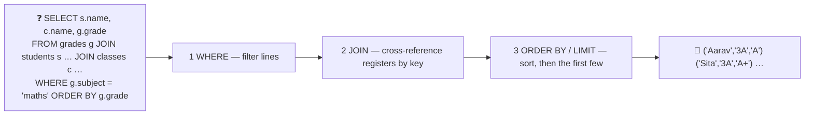

# 🔍 Lesson 03 — SQL reads: asking the archivist

**📍 You are here:** Lesson **03** of 12 · Previous: `lesson-02-tables-rows-keys` · Next: `lesson-04-transactions`

---

## 📦 What's in this branch

Lessons 01–02, **plus** the question language: `SELECT`, `WHERE`,
`ORDER BY`, `LIMIT`, `JOIN` across registers, and `GROUP BY` for
counting.

## 🧒 Explain like I'm 5

You do not walk the shelves yourself. You hand the **archivist** 🧑‍💼 a
question written the standard way, and they decide the fastest route:

- **"Names and roll numbers of 3A students, alphabetical, first two."**
  `SELECT name, roll_no FROM students WHERE class_id = 1 ORDER BY name LIMIT 2`
- **"Every maths grade, with the student's name and class."** Three
  registers, cross-referenced by their keys — a **JOIN**:
  `FROM grades g JOIN students s ON s.id = g.student_id JOIN classes c ON c.id = s.class_id`
- **"How many students per class?"** — a **GROUP BY**: one answer line
  per class, with a `COUNT`.

The archivist's order of work is always the same: **filter** (`WHERE`),
then **group** (`GROUP BY`), then **order** (`ORDER BY`), then **page**
(`LIMIT`/`OFFSET`) — the same filter → sort → paginate the API school's
counter uses, because the counter asks *this* archivist.

## 🗺️ Diagram



## ❓ What

- `SELECT columns FROM table` — which headings, which register.
  `SELECT *` is for exploring, not for programs (columns change).
- `WHERE` filters rows: `=`, `<`, `IN (…)`, `LIKE 'Si%'`, `IS NULL`,
  `AND`/`OR`. `NULL` is "unknown": `= NULL` is never true — use `IS NULL`.
- `JOIN … ON` combines registers by key. `INNER JOIN` keeps matches
  only; `LEFT JOIN` keeps every left row even with no match (lesson 12's
  N+1 fix uses it).
- `GROUP BY` collapses rows into groups; `COUNT`, `SUM`, `AVG`, `MAX`
  summarise them; `HAVING` filters groups.
- `ORDER BY … LIMIT n OFFSET m` — pages. Cursor pagination
  (API school L08) is `WHERE id > :last ORDER BY id LIMIT n`.
- SQL is **declarative**: you say *what*; the planner picks *how*
  (lesson 06 shows you its route with `EXPLAIN QUERY PLAN`).

## 🤔 Why

Because a question you can write in one line replaces a program you
would have to write, test and keep. Every dashboard, report and API
endpoint is a `SELECT` in a costume — and the same four clauses, in the
same order, are behind all of them.

## 🔧 How (in this repo)

`reads()` and `join()` in [db/demo.py](../../db/demo.py) are this lesson;
read the SQL strings aloud in school words before you run them.

## 🧪 Try it

```bash
python3 db/demo.py reads join
python3 - <<'EOF'
import sqlite3; c = sqlite3.connect("db/school.db")
print(c.execute("SELECT name FROM students WHERE name LIKE 'S%' OR roll_no IN ('3B-01')").fetchall())
print(c.execute("SELECT c.name, AVG(CASE g.grade WHEN 'A+' THEN 4.3 WHEN 'A' THEN 4 WHEN 'B+' THEN 3.3 WHEN 'B' THEN 3 ELSE 2 END) FROM grades g JOIN students s ON s.id=g.student_id JOIN classes c ON c.id=s.class_id GROUP BY c.name").fetchall())
print(c.execute("SELECT s.name, COUNT(g.id) FROM students s LEFT JOIN grades g ON g.student_id=s.id GROUP BY s.id HAVING COUNT(g.id) >= 2").fetchall())
EOF
```

## ✅ Verify — what you should see

`reads` prints two 3A students in alphabetical order; `join` prints five maths grades sorted by grade then name, and a `GROUP BY` with `('3A', 3)` and `('3B', 2)`. Your three queries print `Sita` and `Meera`, an average per class, and every student with two or more grades.

## 🏁 What you just proved

You can ask the archivist filtered, joined, grouped and paged questions — and read a `JOIN` as "cross-reference these registers by their keys".

## ⚠️ Common mistakes

- `SELECT *` in application code — a new column silently changes your program's input
- `WHERE grade = NULL` — always false; use `IS NULL`
- forgetting the `ON` condition — a cross join multiplies every row by every row
- `ORDER BY` without `LIMIT` on a huge table (or `LIMIT` without `ORDER BY` — "first 10 of what?")

> 🏭 **Why this matters in production:** slow pages are almost always one query with a missing `WHERE`, a `JOIN` without a key, or an `ORDER BY` on an unindexed column — all readable in the SQL once you know the four clauses.

## ⏭️ Next

Reading is safe; writing needs a pencil with an eraser. **Writes and
transactions** — `INSERT`, `UPDATE`, `DELETE`, and ACID.

```bash
git checkout lesson-04-transactions
```
