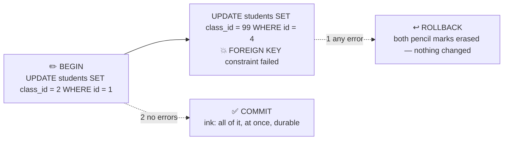

# ✏️ Lesson 04 — Writes & transactions: the ledger in pencil

**📍 You are here:** Lesson **04** of 12 · Previous: `lesson-03-sql-reads` · Next: `lesson-05-data-modelling`

---

## 📦 What's in this branch

Lessons 01–03, **plus** changing the registers safely: `INSERT`,
`UPDATE`, `DELETE`, and the **transaction** — `BEGIN` … `COMMIT`, or
`ROLLBACK` — that makes the four promises of **ACID** real.

## 🧒 Explain like I'm 5

Moving Aarav from 3A to 3B is two lines in two registers: change his
class pointer, and update the class counts. What if the power goes out
between the two? Half a move — Aarav in 3B, the counts still say 3A.

So the archivist writes **in pencil first** ✏️. `BEGIN` opens the
pencil. Both changes go in. If anything goes wrong — an error, a
refused pointer, a crash — the archivist **erases everything**
(`ROLLBACK`) and the registers look exactly as before. Only when both
lines are fine does the archivist go over them in **ink** (`COMMIT`),
all at once, so that even a power cut after that leaves both changes
on the shelf.

That is a **transaction**, and its four promises spell **ACID**:

- **Atomic** — all of the lines or none of them.
- **Consistent** — every constraint still holds after the ink dries.
- **Isolated** — other clerks do not see your pencil marks (lesson 07).
- **Durable** — ink survives the power cut.

## 🗺️ Diagram



## ❓ What

- `INSERT INTO students (name, roll_no, class_id) VALUES (…)`,
  `UPDATE students SET class_id = 2 WHERE id = 1`,
  `DELETE FROM students WHERE id = 5`. **Always** write the `WHERE` on
  `UPDATE`/`DELETE` first — without it, every row changes.
- `BEGIN` / `COMMIT` / `ROLLBACK`. In Python: `with conn:` commits at
  the end of the block and rolls back if an exception escapes it — the
  pattern in `txn()`.
- **Autocommit** = every statement its own transaction. Fine for one
  line; wrong for two lines that must agree.
- **Durability** costs a disk sync per commit; that is why one
  transaction with 1,000 inserts is far faster than 1,000 transactions.
- Constraint failures happen at write time (`IntegrityError`) — the
  schema from lesson 02 is enforced inside the transaction, so a
  refused line rolls the whole pencil back.

## 🤔 Why

Because money, enrolment, inventory and bookings are all "two lines that
must agree", and the world's most expensive bugs are half-transactions.
The eraser is the difference between "something went wrong" and
"something went wrong and now the data lies".

## 🔧 How (in this repo)

`txn()` in [db/demo.py](../../db/demo.py): a `with c:` block with two
`UPDATE`s, the second of which points at a class that does not exist.
Watch both changes vanish.

## 🧪 Try it

```bash
python3 db/demo.py txn
python3 - <<'EOF'
import sqlite3; c = sqlite3.connect("db/school.db"); c.execute("PRAGMA foreign_keys = ON")
with c:                                                       # one transaction: enrol + first grade
    cur = c.execute("INSERT INTO students (name, roll_no, class_id) VALUES ('Zoya', '3B-03', 2)")
    c.execute("INSERT INTO grades (student_id, subject, term, grade) VALUES (?, 'maths', 1, 'A')", (cur.lastrowid,))
print(c.execute("SELECT s.name, g.grade FROM students s JOIN grades g ON g.student_id = s.id WHERE s.name='Zoya'").fetchall())
try:
    with c: c.execute("DELETE FROM students")                 # 😱 no WHERE — but inside a transaction…
    # (it committed! there was no error.) Restore:
except Exception as e: print(e)
EOF
python3 db/demo.py >/dev/null && echo "room rebuilt"
```

## ✅ Verify — what you should see

`txn` prints the same two rows before and after the failed transfer — both updates were erased. Your enrolment prints `[('Zoya', 'A')]`. The `DELETE` without `WHERE` **succeeds** (no error, so no rollback) — the room is empty until you rebuild it: a transaction protects against *errors*, not against *mistakes*; lesson 09 is for those.

## 🏁 What you just proved

A failed transaction leaves no half-move behind, a successful one lands all at once — and a correct-but-wrong statement still commits, which is why backups exist.

## ⚠️ Common mistakes

- `UPDATE`/`DELETE` without `WHERE` (write the `WHERE` first, then the verb)
- one statement per transaction in a loop — a thousand disk syncs
- long transactions holding locks while the user thinks (lesson 07)
- catching the exception and *continuing* inside the block — the rollback only happens if the exception escapes

> 🏭 **Why this matters in production:** payment systems are transactions all the way down; "we double-charged" and "the order exists but the stock didn't move" are both a missing `BEGIN`. Frameworks hide the pencil behind `@transactional` — know what it draws.

## ⏭️ Next

Where should each fact live? **Data modelling** — one fact, one place,
and when to break that rule on purpose.

```bash
git checkout lesson-05-data-modelling
```
