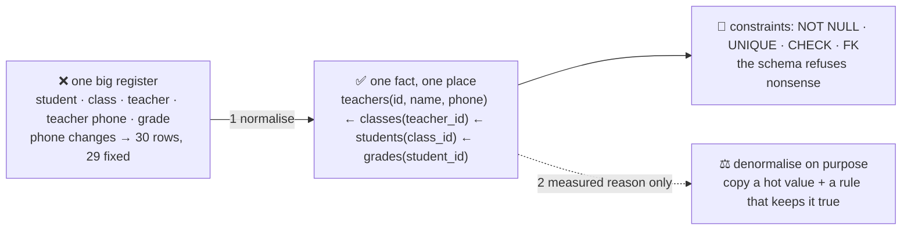

# 🧩 Lesson 05 — Data modelling: one fact, one place

**📍 You are here:** Lesson **05** of 18 · Previous: `lesson-04-transactions` · Next: `lesson-06-indexes`

---

## 📦 What's in this branch

Lessons 01–04, **plus** how to decide what the registers *are*:
**normalisation** (one fact, one place), **constraints** as the written
rules, and **denormalisation** — copying a fact on purpose, with a rule
for keeping it true.

## 🧒 Explain like I'm 5

A new clerk suggests one giant register: every line has the student,
the class, the teacher, the teacher's phone number, the grade, the
subject… Easy to read! Then the teacher changes her phone number. That
is thirty lines to fix, and the clerk fixes twenty-nine. For a year, one
line lies.

The rule that prevents it: **one fact, one place.** The teacher's phone
number lives in *one* line of a *teachers* register; students point at
their class, classes point at their teacher. Change the number once and
every question that joins through the pointer sees the new one. That is
**normalisation**, and its three questions per register are:

1. What is *one line*? (one student — not one student-per-subject)
2. What identifies it? (the line number; roll number is `UNIQUE`)
3. Which facts belong to *it*, not to something it points at? (the
   student's name: yes; the class teacher's phone: no)

And the exception, made on purpose: sometimes a question is asked so
often and joins so much that you **copy** a fact next to where it is
read — a **denormalised** column — and you write down the rule that
keeps the copy true (a trigger, a nightly job, or "only via this one
function"). Copy with a reason and a rule, never by accident.

## 🗺️ Diagram



## ❓ What

- **1NF**: one value per cell (no "maths, science" in one column — that
  is a `grades` register). **2NF/3NF** in practice: every non-key column
  describes the row's key and nothing else — if it describes something
  the row points at, it belongs over there.
- **Constraints are modelling**: `CHECK (term IN (1,2,3))`,
  `UNIQUE (student_id, subject, term)`, `NOT NULL` — the rules of the
  domain written into the shelf, enforced for every program.
- **Types matter**: dates as ISO strings (`2026-10-03`) or `DATE`;
  money as integers in the smallest unit, never floats; booleans as
  `0/1` or `BOOLEAN`.
- **Denormalisation**: a `students.grade_count` column updated by a
  trigger; a nightly `class_summary` table; a copied `class_name` on
  hot read paths. Allowed with a measured reason (lesson 12) and an
  owner for the rule.
- **Naming**: tables plural (`students`), columns snake_case, foreign
  keys `<thing>_id`. Boring names are a kindness.

## 🤔 Why

Because the schema outlives every program that uses it. A well-modelled
room lets a new question be one `JOIN` away; a badly-modelled one makes
every new question a data clean-up first. And constraints turn "we
should validate that somewhere" into "the shelf already does".

## 🔧 How (in this repo)

[db/schema.sql](../../db/schema.sql) is normalised: `classes`,
`students`, `grades`, `homework`, each fact once, connected by keys, with
`UNIQUE` and `CHECK` rules. `model()` in `demo.py` shows the shelf
refusing two kinds of nonsense.

## 🧪 Try it — the capstone's first stone

```bash
# 1) add a teachers register, properly: in db/schema.sql
#    CREATE TABLE IF NOT EXISTS teachers (id INTEGER PRIMARY KEY, name TEXT NOT NULL, phone TEXT);
#    and give classes a pointer:  teacher_id INTEGER REFERENCES teachers(id)
# 2) seed one teacher per class in db/seed.sql, rebuild, and ask:
python3 db/demo.py model >/dev/null
python3 - <<'EOF'
import sqlite3; c = sqlite3.connect("db/school.db")
print(c.execute("SELECT s.name, t.name, t.phone FROM students s JOIN classes c ON c.id=s.class_id JOIN teachers t ON t.id=c.teacher_id ORDER BY s.name").fetchall())
c.execute("UPDATE teachers SET phone='000' WHERE id=1"); c.commit()     # change the fact ONCE
print(c.execute("SELECT DISTINCT t.phone FROM students s JOIN classes c ON c.id=s.class_id JOIN teachers t ON t.id=c.teacher_id WHERE c.id=1").fetchall())
EOF
```

## ✅ Verify — what you should see

Every 3A student's line shows the same teacher and phone; after one `UPDATE` on `teachers`, the joined query shows `[('000',)]` — one change, every student sees it. A duplicate roll number or a grade of `Z` is still refused.

## 🏁 What you just proved

You added a new kind of fact to the room in one place, connected it by a key, and changed it once for everyone — the modelling rule, felt.

## ⚠️ Common mistakes

- comma-separated lists in a column ("maths, science") — that is a table
- copying a name where a key belongs (`class TEXT` instead of `class_id`)
- floats for money; strings for dates in three formats
- denormalising "for speed" before measuring — and without a rule that keeps the copy true
- modelling the screen instead of the domain — screens change monthly, the domain does not

> 🏭 **Why this matters in production:** schema design is the one decision that is cheap on day one and ruinous to change on day 400. Teams that normalise first and denormalise with evidence keep their options; the reverse order is a rewrite.

## ⏭️ Next

The room is well shaped — now make questions *fast*: **indexes**, the
card catalogue, and `EXPLAIN`.

```bash
git checkout lesson-06-indexes
```
