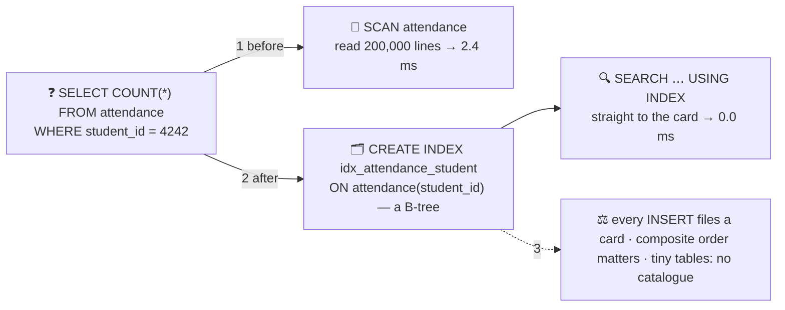

# 🗂️ Lesson 06 — Indexes: the card catalogue

**📍 You are here:** Lesson **06** of 18 · Previous: `lesson-05-data-modelling` · Next: `lesson-07-concurrency`

---

## 📦 What's in this branch

Lessons 01–05, **plus** why some questions take milliseconds and some
take minutes: **indexes** (the card catalogue), **B-trees**, `EXPLAIN
QUERY PLAN`, and the cost every catalogue charges on every write.

## 🧒 Explain like I'm 5

The attendance register has **200,000 lines**. "How many days was
student 4242 present?" — the archivist reads every line. Every time.
That is a **SCAN**: fine at 5 lines, a coffee break at 200,000.

So the archivist builds a **card catalogue** 🗂️: a drawer of cards sorted
by student number, each card saying which lines that student is on. Now
"student 4242" is a straight walk to one card — a **SEARCH**. Same
question, from 2.4 ms to nothing you can measure.

The catalogue is not free: **every time a line is added, its card must
be filed too**. A register with ten catalogues writes ten cards per line.
And a catalogue for a 5-line register is slower than reading the 5
lines. So: index the columns you **filter, join and sort on**, and ask
the archivist for the route first — `EXPLAIN QUERY PLAN` — before
building anything.

## 🗺️ Diagram



## ❓ What

- **Index** = a sorted structure (usually a **B-tree**) over one or
  more columns, pointing back to rows. Primary keys and `UNIQUE`
  constraints get one automatically.
- `EXPLAIN QUERY PLAN <query>` (SQLite; `EXPLAIN` / `EXPLAIN ANALYZE` in
  Postgres) shows `SCAN` vs `SEARCH … USING INDEX` — the route before
  the walk.
- **What to index**: columns in `WHERE`, `JOIN … ON`, `ORDER BY`;
  foreign keys (a join without an index on the many side scans).
- **Composite indexes** `(class_id, name)` serve `WHERE class_id = ?
  ORDER BY name` — but not `WHERE name = ?` alone: order matters,
  leftmost first.
- **Costs**: slower writes, more space, and the planner may still
  choose a scan when the table is tiny or the filter matches most rows.
- **Covering index**: when the index holds every column the query
  needs, the register is never opened (`USING COVERING INDEX`).

## 🤔 Why

Because the difference between an app that "gets slow as it grows" and
one that does not is almost entirely which questions have a card
catalogue. And because unindexed writes are cheap but unindexed reads
compound: the day the table crosses a million rows is the day a
missing index becomes an outage.

## 🔧 How (in this repo)

`index()` in [db/demo.py](../../db/demo.py) builds a 200,000-row
`attendance` table, times the question without an index, creates one,
and times it again — printing `EXPLAIN QUERY PLAN` both times.
`schema.sql` already indexes the two foreign keys.

## 🧪 Try it

```bash
python3 db/demo.py index
python3 - <<'EOF'
import sqlite3, time; c = sqlite3.connect("db/school.db")
for q in ["SELECT * FROM grades WHERE subject = 'maths'", "SELECT * FROM students WHERE class_id = 1 ORDER BY name"]:
    print(c.execute("EXPLAIN QUERY PLAN " + q).fetchall()[0][3], "←", q)
c.execute("CREATE INDEX IF NOT EXISTS idx_grades_subject ON grades(subject)")
print(c.execute("EXPLAIN QUERY PLAN SELECT * FROM grades WHERE subject = 'maths'").fetchall()[0][3], "← after the index")
# the cost side: time 20,000 inserts into attendance with the index present
t=time.perf_counter(); c.executemany("INSERT INTO attendance (student_id, day, present) VALUES (?,?,?)", [(i, '2026-01-01', 1) for i in range(20000)]); c.commit(); print(f"20,000 inserts with an index: {(time.perf_counter()-t)*1000:.0f} ms")
EOF
```

## ✅ Verify — what you should see

`index` prints `SCAN attendance` with a millisecond time, then `SEARCH attendance USING COVERING INDEX` with ~0 ms. Your second query already shows `SEARCH … USING INDEX idx_students_class` (the foreign key index from `schema.sql`); the `grades.subject` query flips from `SCAN` to `SEARCH` after you create the index; the timed inserts show the write cost is real but small.

## 🏁 What you just proved

You turned a full read of 200,000 lines into a card lookup, saw the planner's route change, and measured what the catalogue costs on writes.

## ⚠️ Common mistakes

- indexing every column "just in case" — writes crawl and the planner ignores most of them
- forgetting foreign-key indexes — every JOIN on the many side scans
- a composite index in the wrong order (`(name, class_id)` for `WHERE class_id = ?`)
- `WHERE LOWER(email) = ?` on an index over `email` — the function hides the column (use an expression index)
- measuring on 5 rows and shipping — the planner behaves differently at scale

> 🏭 **Why this matters in production:** "add an index" is the most common one-line fix that turns a 30-second page into 30 milliseconds — and the most common one-line change that quietly halves write throughput. `EXPLAIN` before and after, every time.

## ⏭️ Next

Part 2 begins: running the record room for real. First, two clerks and
one register — **concurrency and isolation**.

```bash
git checkout lesson-07-concurrency
```
