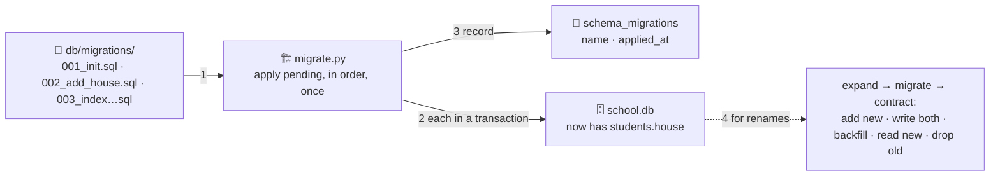

# 🏗️ Lesson 08 — Migrations: renovating the room while school is open

**📍 You are here:** Lesson **08** of 18 · Previous: `lesson-07-concurrency` · Next: `lesson-09-backups-recovery`

---

## 📦 What's in this branch

Lessons 01–07, **plus** how the shape of the room changes without
closing the school: **versioned migration scripts**, the **logbook**
(`schema_migrations`), and the **expand → migrate → contract** pattern
for zero-downtime change. Real files:

- [db/migrate.py](../../db/migrate.py) — the renovation crew, 30 lines
- [db/migrations/](../../db/migrations/) — `001_init`, `002_add_house`, `003_index_grades_subject`

## 🧒 Explain like I'm 5

The school wants a new column in the students register: **house**
(red, blue…). The room is open; clerks are writing in it right now. You
cannot close the school for a week.

So renovations are done as **numbered work orders** 🏗️, kept in git,
applied **in order, once each**, and recorded in a **logbook** —
`schema_migrations` — so any copy of the room can say "I have had work
orders 001 to 003." Run the crew twice and it does nothing the second
time.

And a rename is never one step. To rename `class` to `section` while
clerks keep writing:

1. **Expand** — add `section` next to `class` (old code ignores it).
2. **Migrate** — ship code that writes *both*; backfill the old rows.
3. Ship code that *reads* `section`.
4. **Contract** — drop `class`.

Every step keeps school open; every step can be rehearsed on a copy.

## 🗺️ Diagram



## ❓ What

- **Migration**: a script that changes schema (or data) from version N
  to N+1. Numbered or timestamped; committed with the code that needs it.
- **Logbook**: a table of applied migrations. The tool applies only what
  is missing. Tools: Flyway, Liquibase, Alembic, Prisma Migrate, Rails
  — all this pattern.
- **Reversible**: write the `down` step when you can; when you cannot
  (dropping a column), rehearse on a copy and have a backup (lesson 09).
- **Expand/contract**: additive first (new column with a default, new
  table), destructive last, code deployed in between. Never `RENAME` a
  column in one step on a live table.
- **Backfills** on big tables run in batches with pauses — one giant
  `UPDATE` locks the register for everyone (lesson 07).
- SQLite note: `ALTER TABLE` is limited (add column, rename); Postgres
  can add a column with a default instantly, but some changes rewrite
  the table — read your database's notes before a big one.

## 🤔 Why

Because "someone ran `ALTER TABLE` on production by hand on a Friday" is
how schemas become unknowable and rollbacks become memory. Migrations in
git make the shape of the room reviewable, repeatable and rehearsable —
and expand/contract is the only way a rename does not become an outage.

## 🔧 How (in this repo)

`db/migrate.py` creates the logbook, lists `db/migrations/*.sql`, applies
each unapplied file inside a transaction and records it. `002_add_house`
is an expand step; `003` adds an index a new question needed.

## 🧪 Try it

```bash
python3 db/demo.py >/dev/null           # a fresh room (schema.sql already includes 001's tables)
python3 db/migrate.py status            # ⏳ all three pending
python3 db/migrate.py                   # applied 001, 002, 003
python3 db/migrate.py                   # nothing to do — idempotent
python3 -c "import sqlite3; c=sqlite3.connect('db/school.db'); print(c.execute('SELECT name, house FROM students LIMIT 2').fetchall()); print(c.execute('SELECT name FROM schema_migrations').fetchall())"
# your migration: expand → contract for a rename, in two files
printf -- '-- expand: new column next to the old one\nALTER TABLE homework ADD COLUMN heading TEXT;\nUPDATE homework SET heading = title;\n' > db/migrations/004_homework_heading_expand.sql
python3 db/migrate.py && python3 -c "import sqlite3; print(sqlite3.connect('db/school.db').execute('SELECT title, heading FROM homework').fetchall())"
# (005 — the contract step that drops `title` — only after every reader uses `heading`; write it, don't run it yet)
```

## ✅ Verify — what you should see

`status` shows three ⏳, then three ✅; the second run prints only `up to date`; every student has `house = 'red'`; your `004` applies once and `heading` mirrors `title`. The logbook lists four names.

## 🏁 What you just proved

The room changed shape four times without being rebuilt, each change recorded, none applied twice — and you wrote the expand half of a rename that never blocks a clerk.

## ⚠️ Common mistakes

- editing an already-applied migration — write a new one; history is append-only
- renaming or dropping in one step on a live table
- a backfill as one giant `UPDATE` on a big table
- migrations that depend on today's data shape without checking it
- no rehearsal on a copy before a destructive step (lesson 09 is the safety net)

> 🏭 **Why this matters in production:** zero-downtime deploys are a schema discipline before they are a Kubernetes one. Every team that ships daily runs migrations in CI, expand/contract by default, and treats a hand-run `ALTER` as an incident.

## ⏭️ Next

Renovations can go wrong; so can Friday afternoons. **Backups and
recovery** — RPO, RTO, and the restore drill you actually run.

```bash
git checkout lesson-09-backups-recovery
```
