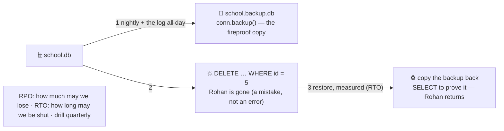

# 🧯 Lesson 09 — Backups & recovery: the fireproof copy

**📍 You are here:** Lesson **09** of 12 · Previous: `lesson-08-migrations` · Next: `lesson-10-scaling`

---

## 📦 What's in this branch

Lessons 01–08, **plus** the promise that outlives every other: **a copy
of the room in another building**, the two numbers the school agrees on
before the fire (**RPO**, **RTO**), **point-in-time** recovery, and the
restore drill nobody wants and everybody needs.

## 🧒 Explain like I'm 5

Lesson 04 proved a transaction erases *errors*. It does nothing for
*mistakes*: `DELETE FROM students` without a `WHERE` commits perfectly.
Nor for fires, floods, stolen laptops or a disk that dies on a Sunday.

So the archivist keeps a **fireproof copy** 🧯 in another building:
every night a photocopy of every register (a **full backup**), and all
day long a copy of every pencil-and-ink line as it is written (the
**write-ahead log**). With both, the school can rebuild the room as it
was at **any minute** — **point-in-time recovery**.

Two numbers are agreed *before* anything burns:

- **RPO** — how much may we lose? "Five minutes of log" or "one day of
  dump" — it decides how often you copy.
- **RTO** — how long may the room be shut? It decides how fast the
  restore must be — and it is measured with a stopwatch, in a **drill**.

Because the oldest rule of the record room is: **a backup nobody has
restored is a rumour.**

## 🗺️ Diagram



## ❓ What

- **Full backup**: a consistent copy (`sqlite3 .backup`, `pg_dump`,
  snapshots). **Incremental / log shipping**: the WAL since the last
  full copy, replayed to reach a point in time.
- **RPO** (recovery point objective): acceptable data loss. **RTO**
  (recovery time objective): acceptable downtime. Both are business
  decisions; the backup schedule and the restore tooling follow.
- **3-2-1**: three copies, two media, one off-site — a backup on the
  same disk is not a backup; a backup in the same building is not fire-
  proof (AWS L17: RDS snapshots to another region).
- **Test the restore**: restore into a scratch database, run checks
  (`SELECT COUNT(*)`, a known row), time it. Automate it monthly.
- **Replication is not backup**: a replica faithfully replicates the
  `DELETE` (lesson 10). Point-in-time recovery is what undoes mistakes.
- Encrypt backups; control who can read them — they *are* the data.

## 🤔 Why

Because every other lesson assumes the room exists. Durability (lesson
01) protects against crashes, not against `rm`, ransomware, a bad
migration or a well-meaning `DELETE`. The restore drill is the only
proof that "we have backups" means anything.

## 🔧 How (in this repo)

`backup()` in [db/demo.py](../../db/demo.py) makes a copy with
`conn.backup()`, deletes Rohan, then copies the backup back and proves he
returned. The stopwatch is yours to add.

## 🧪 Try it — the drill

```bash
python3 db/demo.py backup
python3 - <<'EOF'
import sqlite3, shutil, time, os
src = sqlite3.connect("db/school.db"); dst = sqlite3.connect("db/drill.db"); src.backup(dst); dst.close()   # 1) the copy
before = src.execute("SELECT COUNT(*) FROM grades").fetchone()[0]
src.execute("DELETE FROM grades"); src.commit()                                                              # 2) the mistake
t = time.perf_counter(); src.close(); shutil.copy("db/drill.db", "db/school.db")                             # 3) the restore
after = sqlite3.connect("db/school.db").execute("SELECT COUNT(*) FROM grades").fetchone()[0]
print(f"grades before {before}, after restore {after}, RTO {(time.perf_counter()-t)*1000:.1f} ms"); os.remove("db/drill.db")
EOF
```

## ✅ Verify — what you should see

`backup` prints the student list without Rohan, then with him again. Your drill prints `grades before 10, after restore 10` and an RTO in milliseconds — you measured a restore instead of assuming one.

## 🏁 What you just proved

A mistake that a transaction cannot undo was undone by a copy you had tested — and you know your RPO (one copy ago) and RTO (the stopwatch).

## ⚠️ Common mistakes

- backups on the same disk or the same building as the room
- never restoring — the backup that "worked" but was empty, encrypted with a lost key, or three schemas old
- believing replicas are backups — they replicate the mistake in milliseconds
- agreeing RPO/RTO *after* the incident
- backups nobody can read in an outage (credentials in the thing that is down)

> 🏭 **Why this matters in production:** the companies that survived their worst database day are the ones with a restore drill on the calendar. Managed services (RDS, lesson 10) automate the copying; the drill and the two numbers are still yours.

## ⏭️ Next

More students, more clerks, more questions: **scaling** — pools,
caches, replicas, partitions, and the order teams actually follow.

```bash
git checkout lesson-10-scaling
```
