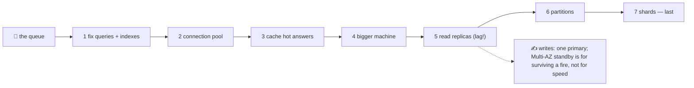

# 📈 Lesson 10 — Scaling: more clerks, more rooms

**📍 You are here:** Lesson **10** of 12 · Previous: `lesson-09-backups-recovery` · Next: `lesson-11-nosql-other-rooms`

---

## 📦 What's in this branch

Lessons 01–09, **plus** what to do when the room is busy: **connection
pools**, **caches**, **read replicas** (and their lag), **partitions**,
**sharding** — and the order in which teams actually reach for them.

## 🧒 Explain like I'm 5

The school grew. The record room has a queue out of the door. What
now? The same list, in the same order, every time:

1. **Fix the questions first** — most queues are one slow question
   asked a thousand times (a missing card catalogue, lesson 06; an N+1,
   lesson 12).
2. **A pool of clerks** 🚰 — opening a new connection per request is
   like hiring a clerk per visitor. Keep a pool; reuse them.
3. **A notice board of hot answers** 🧊 (a **cache**, e.g. Redis) —
   "how many students in 3A?" is asked every second and changes twice a
   day. Pin the answer at the counter for a minute.
4. **A bigger room** — more memory and faster disks go a long way.
5. **Read-only copies of the room** 📖 (**replicas**) — readers go to
   the copies, writers to the one original. The copies are a beat
   behind (**replication lag**): read your own write from the original.
6. **Partitions** — the attendance register split by year; old years on
   a slower shelf.
7. **Shards** 🏢 — separate rooms by region or school. Last resort:
   questions across rooms, and transactions across rooms, get hard.

Most schools never need steps 6–7. The ones that do got there by doing
1–5 first.

## 🗺️ Diagram



## ❓ What

- **Connection pool** (pgbouncer, HikariCP, the driver's pool):
  connections are expensive; limit them (databases fall over at
  thousands) and reuse them.
- **Cache**: key → answer with a TTL; invalidate on write or accept
  brief staleness. Cache the *hot and slow*, not everything.
- **Read replicas**: streaming copies; near-instant but not instant.
  Route reads that tolerate lag; route "read your own write" to the
  primary. Also a warm standby for failover.
- **Vertical scaling**: bigger instance — the cheapest step per hour of
  engineering, up to a point.
- **Partitioning**: one logical table, many physical pieces (by date,
  region); queries that hit one partition get faster; maintenance gets
  easier.
- **Sharding**: separate databases by key; the application routes.
  Cross-shard JOINs and transactions become application code.
- **Managed** (AWS L17, RDS): replicas, Multi-AZ, snapshots as
  checkboxes; the queries, indexes and schema remain yours.

## 🤔 Why

Because scaling stories fail in one of two ways: sharding a 50 GB
database because a blog said so (a year lost), or never adding an index
and calling the database "slow" (a customer lost). The ladder is the
defence against both — and every rung is cheaper than the next.

## 🔧 How (in this repo)

SQLite is one file, so replicas and shards are paper exercises here —
but the pool, the cache and the "fix the query first" rung are real:
lesson 06's index and lesson 12's N+1 are rungs 1; the code below is
rungs 2–3 in miniature.

## 🧪 Try it

```bash
python3 - <<'EOF'
import sqlite3, time
# rung 2: a pool in miniature — one connection reused vs opened per request
t=time.perf_counter()
for _ in range(2000): sqlite3.connect("db/school.db").execute("SELECT 1").fetchone()
per_request=(time.perf_counter()-t)*1000
c=sqlite3.connect("db/school.db"); t=time.perf_counter()
for _ in range(2000): c.execute("SELECT 1").fetchone()
pooled=(time.perf_counter()-t)*1000
print(f"2000 queries — new connection each: {per_request:.0f} ms · one reused connection: {pooled:.0f} ms")
# rung 3: a cache with a TTL for a hot, slow-ish question
cache={}; TTL=60
def class_size(cls):
    hit=cache.get(cls)
    if hit and time.time()-hit[1] < TTL: return hit[0], "cache"
    n=c.execute("SELECT COUNT(*) FROM students s JOIN classes k ON k.id=s.class_id WHERE k.name=?", (cls,)).fetchone()[0]
    cache[cls]=(n, time.time()); return n, "db"
print(class_size("3A"), class_size("3A"))
EOF
# paper exercise (5 min): your app shows "your enrolment was saved" then lists students from a replica — what can the user see, and what do you change?
```

## ✅ Verify — what you should see

The reused connection is many times faster than a connection per query (the pool rung, measured); the second `class_size` call answers from `cache`. Your paper answer: the new student may be missing for a moment (lag) — read-your-own-write goes to the primary, or the UI shows the saved row locally.

## 🏁 What you just proved

Two of the cheapest rungs — reuse connections, cache hot answers — measured on a real database, and the replica-lag trap named before you meet it.

## ⚠️ Common mistakes

- sharding before indexing
- unbounded connections (every app instance × every worker) — the database collapses under connections, not queries
- caching everything (or with no TTL) — stale data with no way to refresh
- reading your own write from a replica
- treating Multi-AZ as a performance feature — it is a survival feature

> 🏭 **Why this matters in production:** the ladder is what a senior engineer says when asked "the DB is slow, should we shard?": *show me the slow query log first*. Most scaling wins in real companies came from rungs 1–3.

## ⏭️ Next

Not every question fits a register. **NoSQL and other rooms** — document,
key-value, columnar, graph, vector — and how to choose.

```bash
git checkout lesson-11-nosql-other-rooms
```
