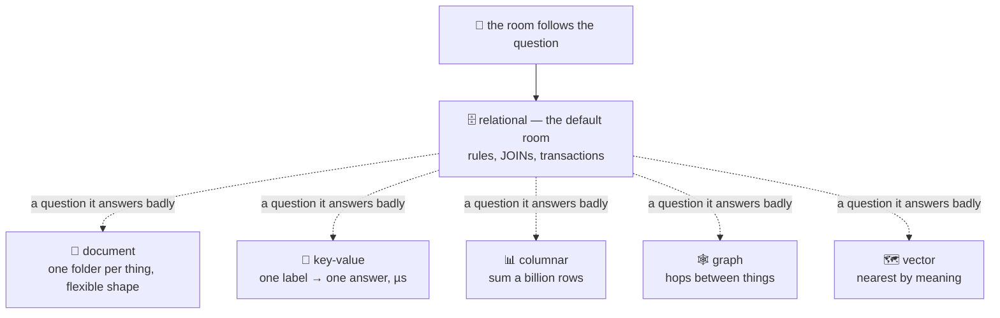

# 🏘️ Lesson 11 — NoSQL & other rooms: choosing the room for the question

**📍 You are here:** Lesson **11** of 18 · Previous: `lesson-10-scaling` · Next: `lesson-12-performance-ops`

---

## 📦 What's in this branch

Lessons 01–10, **plus** the other kinds of room a school might build —
**document**, **key-value**, **columnar**, **graph**, **vector** — what
each answers well, what each gives up, and the one rule for choosing.

## 🧒 Explain like I'm 5

The record room is the relational room: registers, keys, rules, JOINs,
transactions. It answers almost every school question well. But some
questions are awkward there, so schools build other rooms:

- **The document room** 📄 (MongoDB): each student is one folder with
  everything inside — nested, flexible, no fixed headings. Great when
  each record is read whole; awkward when you ask across folders.
- **The key-value room** 🔑 (Redis, DynamoDB): one label, one answer,
  in microseconds. Sessions, counters, the cache from lesson 10.
- **The columnar room** 📊 (BigQuery, ClickHouse): registers stored
  column by column, so "sum attendance over ten years" flies; editing
  one line is slow. Analytics, not the daily counter.
- **The graph room** 🕸️ (Neo4j): "friends of friends who share a
  class" — hops between things, not JOINs across registers.
- **The meaning hall** 🗺️ (vector databases — the
  [VectorDB school](https://baluraut.github.io/learn-vectordb-school/)):
  nearest-by-meaning, for search and RAG.

The rule: **the room follows the question.** Start in the relational
room; build another only for a question it answers badly — and keep
the truth in one place.

## 🗺️ Diagram



## ❓ What

- **Document**: JSON records, schema-on-read, nested arrays; indexes on
  fields; weaker cross-document transactions (improving). Wins when the
  record is the unit of work (a product page, a profile).
- **Key-value**: hash lookups; TTLs; simple data structures (Redis
  lists, sets). Not for questions ("all keys where…").
- **Columnar / warehouse**: append-heavy, batch loads, aggregate
  queries; separate from the transactional room (ETL/ELT feeds it).
- **Graph**: nodes and edges; traversals that would be six self-JOINs.
- **Vector**: embeddings + approximate nearest neighbour; the RAG page
  finder. Postgres has `pgvector` for modest scale.
- **Time-series, search** (Elasticsearch/OpenSearch) — more rooms for
  more questions; the same rule applies.
- **CAP / consistency**: distributed rooms trade consistency for
  availability under partition; "eventually consistent" means your read
  may be stale — decide per question whether that is acceptable.

## 🤔 Why

Because "NoSQL because scale" without a measured question cost many
teams their constraints, their JOINs and their transactions — and they
bought them back at great expense. And because the opposite mistake is
real too: forcing analytics or meaning-search through a transactional
room. Name the question; then name the room.

## 🔧 How (in this repo)

SQLite plays two rooms honestly: the relational one (every lesson) and,
with a JSON column, a small document one — the exercise below. The
meaning hall next door is the VectorDB school's `vectordb/vectordb.py`.

## 🧪 Try it

```bash
python3 - <<'EOF'
import sqlite3, json; c = sqlite3.connect("db/school.db")
c.execute("CREATE TABLE IF NOT EXISTS profiles (student_id INTEGER PRIMARY KEY REFERENCES students(id), doc TEXT NOT NULL)")
c.execute("INSERT OR REPLACE INTO profiles VALUES (2, ?)", (json.dumps({"clubs": ["chess", "robotics"], "guardian": {"name": "R. Rao", "phone": "555-0102"}}),))
c.commit()
print(c.execute("SELECT s.name, json_extract(p.doc, '$.guardian.name'), json_extract(p.doc, '$.clubs[0]') FROM profiles p JOIN students s ON s.id = p.student_id").fetchall())
print(c.execute("SELECT s.name FROM profiles p JOIN students s ON s.id=p.student_id, json_each(p.doc, '$.clubs') j WHERE j.value = 'robotics'").fetchall())
EOF
# paper exercise: for each question, name the room — (a) 'how many students were present each month for 10 years?'
# (b) 'is the session token valid?' (c) 'which students share two clubs with Sita?' (d) 'find the policy paragraph closest in meaning to this question' (e) 'transfer Aarav to 3B and update the counts'
```

## ✅ Verify — what you should see

The document exercise prints Sita's guardian and first club from JSON inside a relational row, and finds robotics members with `json_each` — a document room inside the record room, with the key still relational. Paper: (a) columnar, (b) key-value, (c) graph (or a self-JOIN at this size), (d) vector, (e) relational — the transaction.

## 🏁 What you just proved

Rooms are chosen per question, and the relational room can host a small document room without giving up its keys.

## ⚠️ Common mistakes

- picking a room by fashion or by "what scales" — measure the question
- two rooms holding the same truth with no owner — they will disagree
- running analytics on the transactional room at 9 am
- assuming "eventually consistent" is fine for money or seats
- a document store because "the schema keeps changing" — that is a modelling problem (lesson 05), not a room problem

> 🏭 **Why this matters in production:** most real systems are Postgres + Redis + one analytics room, with a search or vector room when a product needs it. The interview question is never "which is best" — it is "which question, and what does the room give up".

## ⏭️ Next

The last mile: **performance and operations** — slow-query triage, N+1,
and the on-call checklist for the record room.

```bash
git checkout lesson-12-performance-ops
```
