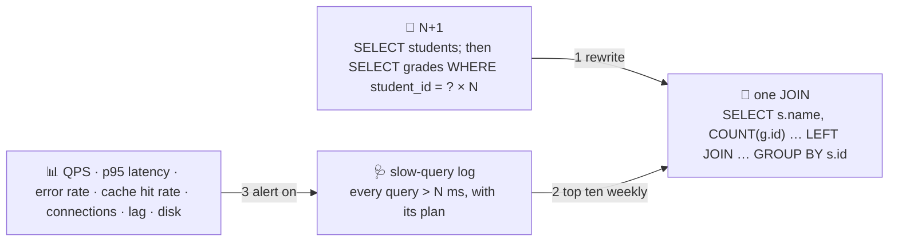

# 🩺 Lesson 12 — Performance & operations: the record room on call

**📍 You are here:** Lesson **12** of 18 · Previous: `lesson-11-nosql-other-rooms` · Next: `lesson-13-security`

---

## 📦 What's in this branch

The complete course, **plus** the last mile: the **N+1** trap, the
**slow-query log**, the metrics that matter, and the **on-call
checklist** for a record room that other people depend on.

## 🧒 Explain like I'm 5

A report needs every student and their grades. The lazy way sends the
archivist **one question for the list, then one question per student**
— six trips for five students, a thousand and one trips for a thousand.
That is **N+1**, and it is the most common slow page in the world. The
fix is one trip: a `JOIN` (or one `WHERE id IN (…)`).

How do you find such things before users do? The archivist keeps a
**slow-question log** 🩺: every question that took longer than N
milliseconds, with its route (`EXPLAIN`). Read it weekly; the top ten
are your next ten fixes.

And when the room is on call, a short checklist answers "is it
healthy?" faster than any dashboard tour:

- connections near the limit? · replication lag? · disk and log growth?
- lock waits and deadlocks? · the slowest ten queries this week?
- when was the last **restore drill**?

## 🗺️ Diagram



## ❓ What

- **N+1**: a loop of queries. Fix with `JOIN`, `IN (…)`, or the ORM's
  eager loading (`select_related`, `includes`, `joinedload`).
- **Slow-query log**: `log_min_duration_statement` (Postgres), the slow
  log (MySQL); in code, time every query and log over a threshold with
  the request id (API school L12).
- **Metrics**: queries per second, p95/p99 latency per query family,
  error rate, cache hit ratio (buffer cache!), connections used vs max,
  replication lag, disk free, WAL size, lock waits, deadlocks. Alert on
  the ones that page a human; dashboard the rest.
- **Triage order** for "the database is slow": what changed (deploy,
  data growth)? → slow-query log → `EXPLAIN` the top one → index or
  rewrite → measure again. Then the ladder (lesson 10).
- **Maintenance**: vacuum/analyze (Postgres), statistics, index bloat,
  the restore drill, credential rotation, version upgrades on a copy
  first.

## 🤔 Why

Because a database is operated, not installed. The team that reads the
slow log weekly and drills a restore quarterly has boring on-call; the
team that does neither learns both from an outage. The checklist is the
whole difference.

## 🔧 How (in this repo)

`nplus1()` in [db/demo.py](../../db/demo.py) runs the loop and the JOIN
and times both. The checklist is yours to write for `school.db` — small
rooms need the same questions, on a smaller scale.

## 🧪 Try it — the capstone

```bash
python3 db/demo.py nplus1
python3 - <<'EOF'
import sqlite3, time
c = sqlite3.connect("db/school.db")
# 1) a slow-query log in 6 lines
def q(sql, *a, threshold_ms=0.05):
    t=time.perf_counter(); rows=c.execute(sql, a).fetchall(); ms=(time.perf_counter()-t)*1000
    if ms > threshold_ms: print(f"🐢 {ms:.3f} ms · {sql[:60]} · plan: {c.execute('EXPLAIN QUERY PLAN '+sql, a).fetchall()[0][3]}")
    return rows
q("SELECT COUNT(*) FROM attendance WHERE day = '2026-03-03'")          # a candidate for the log
q("SELECT COUNT(*) FROM attendance WHERE student_id = 4242")           # served by lesson 06's index
# 2) the checklist, measured:
print("rows:", c.execute("SELECT COUNT(*) FROM attendance").fetchone()[0], "· page_size:", c.execute("PRAGMA page_size").fetchone()[0], "· journal:", c.execute("PRAGMA journal_mode").fetchone()[0])
EOF
# 3) capstone: add a teachers table (L05), a migration for it (L08), an index a new question needs (L06),
#    a query that would be N+1 written as one JOIN, and a one-page on-call checklist for school.db.
```

## ✅ Verify — what you should see

`nplus1` shows 6 queries vs 1 with the same answer; your slow-query log prints the `day` query with a `SCAN` plan (a candidate for an index) and stays silent for the indexed `student_id` query. The checklist prints real numbers for a real file.

## 🏁 What you just proved

You can find the slow question, read its route, fix it with one JOIN or one index, and say — with numbers — whether the room is healthy.

## ⚠️ Common mistakes

- ORM loops that hide N+1 behind pretty code — log query counts per request
- alerting on everything (or nothing) — page on what a human must act on now
- tuning by guesswork — the slow log and `EXPLAIN` first, always
- forgetting the restore drill because "nothing changed"
- upgrading the database version on the live room without a rehearsal on a copy

> 🏭 **Why this matters in production:** this is the checklist reviewers use before a database goes on call: slow log on, dashboards with p95 and lag, connection limits and pooling, backups with a drill date, migrations in CI. Miss one and it becomes the incident.

## 🎓 The record room is yours — Part 3 goes deeper

The room runs. Part 3 (lessons 13–18) opens the questions interviews and incidents ask:
`git checkout lesson-13-security`.

### Where you have been

Sticky notes → the record room → registers and keys → asking the
archivist → the ledger in pencil → one fact, one place → the card
catalogue → two clerks, one register → renovating while open → the
fireproof copy → more clerks, more rooms → other rooms → on call.
**You didn't just learn databases — you run one.** 🗄️🎓

Next doors in the school: the
[API school](https://baluraut.github.io/learn-api-school/) puts a counter
in front of this room; the
[VectorDB school](https://baluraut.github.io/learn-vectordb-school/) opens
the meaning hall next door.

```bash
git checkout main
python3 db/demo.py     # one last run, for fun
```
