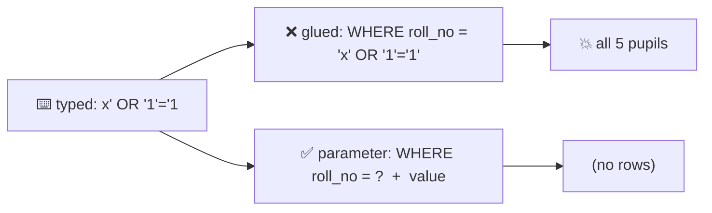

# 🛡️ Lesson 13 — Security: the locked register

**📍 You are here:** Lesson **13** of 18 · Previous: `lesson-12-performance-ops` · Next: `lesson-14-advanced-sql`

> **Part 3 — going deeper.** Lessons 01–12 built and ran the record room. Lessons 13–18 are the
> topics interviews and incidents ask about — each one runs for real on the same `school.db`.

---

## 📦 What's in this branch

Lessons 01–13, plus `inject()` in [db/demo.py](../../db/demo.py): a login that glues the
typed roll number into SQL, the same login with a parameter, and a read-only connection
that is refused a `DELETE`.

## 🧒 Explain like I'm 5

The archivist reads your slip out loud and does exactly what it says. If the slip is
"find roll number **3A-02**", you get Sita. But what if someone writes their *own words*
into the blank — "find roll number **x' OR '1'='1**"? Read out loud, the slip now says
"find roll number x, **or** anything where 1 equals 1" — and 1 always equals 1. The
archivist hands over **every** pupil. That is **SQL injection**.

The fix is a slip with a **sealed envelope** in the blank (`?`). Whatever is inside the
envelope is only ever a *value* to look up — never words the archivist obeys.

And not every clerk gets every key: the reports clerk gets a **read-only pass**.

## 🗺️ Diagram



🗺️ Drawn version + a lab: [https://baluraut.github.io/learn-database-school/lesson-diagrams.html#l13](https://baluraut.github.io/learn-database-school/lesson-diagrams.html#l13)

## ❓ What

- **SQL injection** — user input becomes part of the SQL text, so the input can change the
  question. It can read everything, bypass a login, or (with other drivers) run
  `DROP TABLE`.
- **Parameters** (`?`, `%s`, `:name`, `$1`) — the SQL and the values travel separately; the
  value is never parsed as SQL. Every driver and ORM has them.
- **Least privilege** — each app connects as a role with only what it needs:
  `GRANT SELECT ON grades TO reports;` (Postgres/MySQL). SQLite has no users; the closest
  thing is opening the file read-only (`mode=ro`).
- **Encryption** — in transit (TLS: `sslmode=require` in Postgres) and at rest (the disk or
  the managed service, e.g. RDS). Passwords come from a secret store or environment, never
  from git.

## 🤔 Why

Because the database trusts whoever is connected. Injection has been one of the most
common web attacks for two decades, and it is fixed completely by one habit: never build
SQL by gluing strings. Least privilege limits the damage of every other mistake.

## 🔧 How (in this repo)

`inject()` in [db/demo.py](../../db/demo.py) prints the glued query the database actually
received, runs it (every pupil comes back), runs the parameterised version (no rows),
then opens `school.db` read-only and tries `DELETE FROM grades`.

## 🧪 Try it

```bash
python3 db/demo.py inject
python3 - <<'EOF'
import sqlite3
c = sqlite3.connect("db/school.db")
for typed in ["3A-02", "x' OR '1'='1", "3A-02'; --"]:
    print(repr(typed), "→", c.execute("SELECT name FROM students WHERE roll_no = ?", (typed,)).fetchall())
EOF
```

## ✅ Verify — what you should see

The glued query prints `WHERE roll_no = 'x' OR '1'='1'` and returns all five names; the
parameter returns `(no rows)`; the read-only connection says `attempt to write a readonly
database`. In the snippet, only `3A-02` finds Sita.

## 🏁 What you just proved

You can show an injection working, explain why, and close it with a parameter — and you
can give an app a pass that cannot write at all.

## ⚠️ Common mistakes

- escaping quotes by hand instead of using parameters
- f-strings or `+` to build SQL "just for this one internal tool"
- table or column **names** from user input — parameters cannot hold names; use an allow-list
- the app connecting as the database owner or superuser
- passwords in the repo, in logs, or in the connection string committed to git

> 🏭 **Why this matters in production:** security reviews check exactly this: no string-built
> SQL, separate roles for app / migrations / reports, TLS required, encryption at rest,
> secrets from a vault, and an alert on logins by the superuser.

## ⏭️ Next

`git checkout lesson-14-advanced-sql` — rankings and reports without losing a row.
