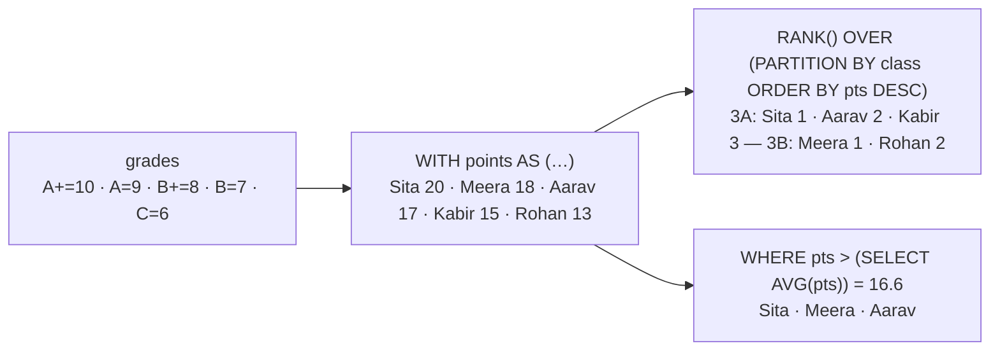

# 🏆 Lesson 14 — Advanced SQL: rankings without losing a row

**📍 You are here:** Lesson **14** of 18 · Previous: `lesson-13-security` · Next: `lesson-15-inside-the-engine`

> **Part 3 — going deeper.** Lessons 01–12 built and ran the record room. Lessons 13–18 are the
> topics interviews and incidents ask about — each one runs for real on the same `school.db`.

---

## 📦 What's in this branch

Lessons 01–14, plus `window()` in [db/demo.py](../../db/demo.py): a CTE that turns grades
into points, `RANK()` and a running total inside each class, a subquery for "above the
school average", and a view called `report_card`.

## 🧒 Explain like I'm 5

`GROUP BY` is like asking each class for **one** number — the class average — and
getting one slip per class back. But the head teacher wants **every pupil** on the list,
with their **place in their class** written next to their name. That is a **window
function**: it looks at a "window" of related rows (the pupil's class) and writes an
extra number on every row, without squashing any.

A **CTE** (`WITH …`) is a little table you build first and then use, like doing the
rough work on the side of the page. A **subquery** is a question inside a question. A
**view** is a question you save and give a name.

## 🗺️ Diagram



🗺️ Drawn version + a lab: [https://baluraut.github.io/learn-database-school/lesson-diagrams.html#l14](https://baluraut.github.io/learn-database-school/lesson-diagrams.html#l14)

## ❓ What

- **Subquery** — `WHERE pts > (SELECT AVG(pts) FROM points)`; also `IN (SELECT …)` and
  `EXISTS (SELECT …)`.
- **CTE** — `WITH name AS (SELECT …) SELECT … FROM name`: readable steps, reusable in one
  query; `WITH RECURSIVE` walks trees (a class → its sections → their pupils).
- **Window functions** — `fn() OVER (PARTITION BY … ORDER BY …)`:
  `ROW_NUMBER`, `RANK`, `DENSE_RANK`, running `SUM`, `AVG` over the last N rows, `LAG` /
  `LEAD` (the previous / next row), `NTILE` (quartiles). Every row is kept.
- **View** — `CREATE VIEW report_card AS SELECT …`: a saved question used like a table. A
  *materialized* view (Postgres) stores the answer and must be refreshed.
- `HAVING` filters groups after `GROUP BY` (lesson 03), `WHERE` filters rows before.

## 🤔 Why

Reports, leaderboards, "top 3 per class", month-over-month change — these are one query
in the room instead of pages of loop code in the app. They are also the most common SQL
interview questions.

## 🔧 How (in this repo)

`window()` in [db/demo.py](../../db/demo.py) — the points are computed with a `CASE`
inside a CTE, then ranked per class, filtered against the average, and saved as a view.

## 🧪 Try it

```bash
python3 db/demo.py window
python3 - <<'EOF'
import sqlite3
c = sqlite3.connect("db/school.db")
P = "CASE grade WHEN 'A+' THEN 10 WHEN 'A' THEN 9 WHEN 'B+' THEN 8 WHEN 'B' THEN 7 ELSE 6 END"
# every pupil's maths grade next to the one before it in the list (LAG) — change maths to science
for row in c.execute(f"""SELECT s.name, g.grade, LAG(g.grade) OVER (ORDER BY {P} DESC) AS previous
                         FROM grades g JOIN students s ON s.id = g.student_id WHERE g.subject = 'maths'"""):
    print(row)
EOF
```

## ✅ Verify — what you should see

`('3A', 'Sita', 20, 1, 20)`, `('3A', 'Aarav', 17, 2, 37)`, `('3A', 'Kabir', 15, 3, 52)`, then
`3B` starting again at rank 1 with Meera; the average is `16.6` and only Sita, Meera and
Aarav are above it; the view returns the same totals. In your snippet the first `previous`
is `None`.

## 🏁 What you just proved

You can rank, total and compare rows inside groups without losing any, and save a question
so every app asks it the same way.

## ⚠️ Common mistakes

- using `GROUP BY` when you need every row — reach for a window
- forgetting `PARTITION BY`, so the rank runs across the whole school
- `RANK` vs `ROW_NUMBER` with ties: RANK gives 1, 1, 3; ROW_NUMBER gives 1, 2, 3
- a correlated subquery that runs once per row on a big table — check `EXPLAIN`
- treating a view as a speed-up: a plain view stores the question, not the answer

> 🏭 **Why this matters in production:** analytics pages, rankings and billing reports are
> written with CTEs and windows; reviewers expect them instead of app-side loops.

## ⏭️ Next

`git checkout lesson-15-inside-the-engine` — why a committed row survives a power cut.
