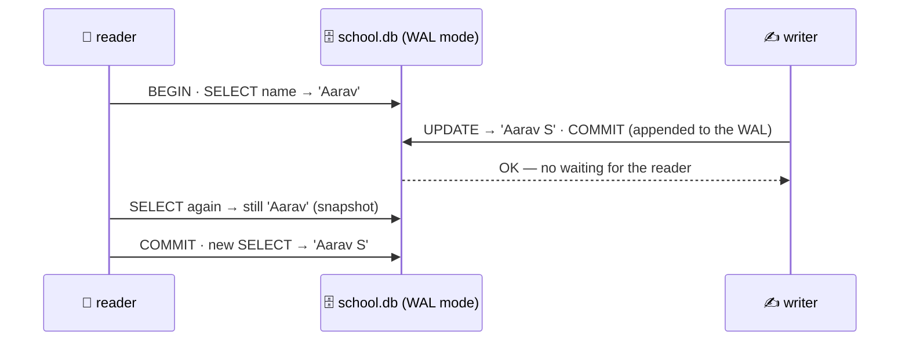

# 📼 Lesson 15 — Inside the engine: the log comes first

**📍 You are here:** Lesson **15** of 18 · Previous: `lesson-14-advanced-sql` · Next: `lesson-16-replication-failover`

> **Part 3 — going deeper.** Lessons 01–12 built and ran the record room. Lessons 13–18 are the
> topics interviews and incidents ask about — each one runs for real on the same `school.db`.

---

## 📦 What's in this branch

Lessons 01–15, plus `wal()` in [db/demo.py](../../db/demo.py): it switches `school.db` to
WAL mode, lets a writer commit while a reader is in the middle of a transaction, shows the
reader keeping its snapshot, measures `school.db-wal`, checkpoints it, and switches back.

## 🧒 Explain like I'm 5

Rewriting a page in the big register is slow and risky — if the lights go out halfway,
the page is half old, half new. So the careful archivist first writes one line in a
**diary** 📼: "page 7: Aarav → Aarav S". Only when the diary line is safely on paper does
she say "done ✅". She copies diary lines into the big register later, when it is quiet.
If the lights go out, she reads the diary and finishes the job. That diary is the
**write-ahead log (WAL)**.

And while she works, a reader who opened the register a minute ago keeps seeing the page
**as it was when they started** — their own photo of the room. That is **MVCC**:
readers never block writers, writers never block readers.

## 🗺️ Diagram



🗺️ Drawn version + a lab: [https://baluraut.github.io/learn-database-school/lesson-diagrams.html#l15](https://baluraut.github.io/learn-database-school/lesson-diagrams.html#l15)

## ❓ What

- **Write-ahead log** — every change is appended to a log and flushed to disk (`fsync`)
  *before* COMMIT returns. Data pages are written later at a **checkpoint**. After a crash,
  the engine replays the log. This is the D in ACID (lesson 04).
- **Buffer cache** — pages live in memory; the log makes it safe for them to reach disk late.
- **MVCC** (multi-version concurrency control) — a row can have several versions; each
  transaction sees the versions that were committed when it started. Postgres keeps old
  row versions in the table and cleans them with **VACUUM**; SQLite in WAL mode keeps the
  new pages in the `-wal` file until a checkpoint.
- SQLite's default (rollback journal) is different: a writer needs the whole file, so it
  waits for readers — that is the `database is locked` from lesson 07.

## 🤔 Why

It explains three things people otherwise take on faith: why an OK'd commit survives a
power cut, why readers don't wait for writers in Postgres, and why a table can grow when
you only UPDATE (old versions waiting for VACUUM). The same log feeds replication (L16)
and change data capture (L18).

## 🔧 How (in this repo)

`wal()` in [db/demo.py](../../db/demo.py) — two real connections to the same file, and the
`-wal` file measured before and after `PRAGMA wal_checkpoint(TRUNCATE)`.

## 🧪 Try it

```bash
python3 db/demo.py wal
python3 - <<'EOF'
import sqlite3
c = sqlite3.connect("db/school.db")
print(c.execute("PRAGMA journal_mode").fetchone())          # delete — the demo switched it back
print(c.execute("PRAGMA journal_mode=WAL").fetchone())      # try it: now open a second python and write while you read
c.execute("PRAGMA journal_mode=DELETE")
EOF
```

## ✅ Verify — what you should see

`journal mode before: delete → after: wal`; the writer commits `'Aarav S'` with no lock
error; the reader in the same transaction still sees `'Aarav'`, and `'Aarav S'` after its
COMMIT; the `-wal` file has a few kilobytes, then `0 bytes` after the checkpoint.

## 🏁 What you just proved

You watched durability and snapshot isolation happen: the log first, pages later, and each
reader keeping its own photo of the room.

## ⚠️ Common mistakes

- believing COMMIT writes the data file — it writes the log
- turning off `fsync` / `synchronous` for speed and losing commits on a crash
- very long transactions: Postgres cannot VACUUM row versions they might still see, and tables bloat
- ignoring WAL/log growth on disk (lesson 12's checklist)
- assuming every engine behaves like SQLite's default journal — Postgres readers never block writers

> 🏭 **Why this matters in production:** WAL settings, checkpoint tuning, autovacuum and
> long-running-transaction alerts are standard database on-call topics.

## ⏭️ Next

`git checkout lesson-16-replication-failover` — ship that log to a copy of the room.
