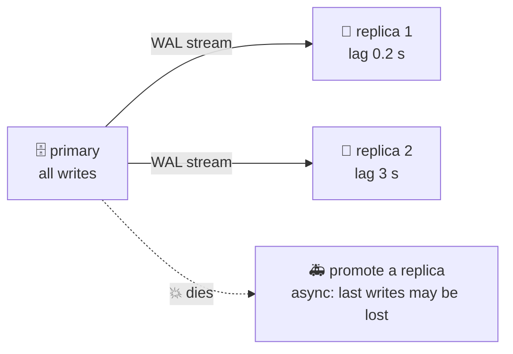

# 📡 Lesson 16 — Replication & failover: copies of the room

**📍 You are here:** Lesson **16** of 18 · Previous: `lesson-15-inside-the-engine` · Next: `lesson-17-app-code`

> **Part 3 — going deeper.** Lessons 01–12 built and ran the record room. Lessons 13–18 are the
> topics interviews and incidents ask about — each one runs for real on the same `school.db`.

---

## 📦 What's in this branch

Lessons 01–16, plus `replica()` in [db/demo.py](../../db/demo.py). It is a **simulation**:
`school.db` plays the primary, an in-memory copy plays the replica, and a Python list plays
the shipped log. It shows replication lag, catching up, and an async failover that loses a
write.

## 🧒 Explain like I'm 5

The school keeps a **copy of the record room** in another building. Every time the main
room changes, a messenger carries the diary lines (lesson 15) across. The copy is useful
for readers — and if the main room burns down, the copy becomes the main room.

But the messenger takes time. A parent enrols Diya, then reloads the page from the copy
before the messenger arrives — "where is Diya?" That is **replication lag**. And if the
main room burns down while a line is still in the messenger's bag, that line is **lost**.
Unless the office waits for the copy to say "got it" before saying "done" — **synchronous
replication** — which is safer but slower.

## 🗺️ Diagram



🗺️ Drawn version + a lab: [https://baluraut.github.io/learn-database-school/lesson-diagrams.html#l16](https://baluraut.github.io/learn-database-school/lesson-diagrams.html#l16)

## ❓ What

- **Streaming replication** — the primary sends its log to replicas, which replay it
  (Postgres physical replication, MySQL binlog replication). Replicas serve reads.
- **Replication lag** — how far behind a replica is. Read your **own** writes from the
  primary, or wait until the replica has caught up.
- **Asynchronous** (the default) — COMMIT returns before any replica has the change. Fast;
  on failover the last writes can be lost (**RPO > 0**, lesson 09).
- **Synchronous** — COMMIT waits for at least one replica's acknowledgement. Nothing
  committed is lost on failover (**RPO = 0**); every commit pays a network round trip, and
  a sick replica can stall writes.
- **Failover** — promote a replica to primary and point the apps at it (a DNS name or a
  proxy). Managed services do this for you (AWS school L17: Multi-AZ).
- **CAP, in one line** — during a network split you must choose: refuse some writes
  (stay consistent) or accept writes on both sides and reconcile later (stay available).

## 🤔 Why

Every production database has a copy; the questions are how fresh it is and what a
failover costs. Knowing sync vs async lets you say, with a number, what an outage loses.

## 🔧 How (in this repo)

`replica()` in [db/demo.py](../../db/demo.py) enrols Diya on the primary, counts pupils on
both sides, ships the log, then writes Ishaan and "kills" the primary before shipping.

## 🧪 Try it

```bash
python3 db/demo.py replica
# then change replica() so ship() is called inside write() — that is synchronous replication.
# Run it again: Ishaan survives the failover.
```

## ✅ Verify — what you should see

`primary: 6 students · replica, before the log arrives: 5 — replication lag`, then `6`
after shipping, then `Ishaan is LOST` after the failover. With your synchronous change,
Ishaan is there.

## 🏁 What you just proved

You can explain lag, read-your-own-writes, and exactly which writes an async failover
loses — and what synchronous replication costs to prevent it.

## ⚠️ Common mistakes

- reading your own fresh write from a replica and "losing" it
- assuming a replica is a backup — a `DELETE` replicates too; backups (lesson 09) are separate
- synchronous replication to a far-away region on every commit
- never testing failover until the real outage
- apps with the primary's IP hard-coded instead of a name that failover can move

> 🏭 **Why this matters in production:** RPO/RTO targets decide sync vs async; failover
> drills and replica-lag alerts are on every database runbook.

## ⏭️ Next

`git checkout lesson-17-app-code` — the database, seen from the app.
