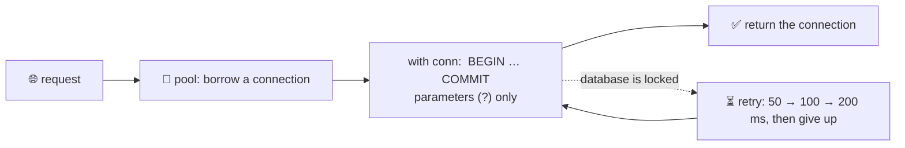

# 🧑‍💻 Lesson 17 — The database from code

**📍 You are here:** Lesson **17** of 18 · Previous: `lesson-16-replication-failover` · Next: `lesson-18-oltp-olap`

> **Part 3 — going deeper.** Lessons 01–12 built and ran the record room. Lessons 13–18 are the
> topics interviews and incidents ask about — each one runs for real on the same `school.db`.

---

## 📦 What's in this branch

Lessons 01–17, plus `appcode()` in [db/demo.py](../../db/demo.py): 2,000 inserts committed
one by one vs in one transaction, and a write that meets `database is locked` and succeeds
on the third attempt with exponential backoff.

## 🧒 Explain like I'm 5

A helper carries forms from the classroom to the record room. If she walks to the room,
hands over **one** form, waits for the stamp, and walks back — 2,000 times — the day is
gone. If she carries **one box** of 2,000 forms and gets **one** stamp, it takes a moment.
Every **COMMIT** is a walk to the room.

Sometimes the room's door is locked for a moment because another clerk is inside. A
sensible helper waits a little, tries again, waits a bit longer, tries again — and gives
up politely after a few tries instead of banging on the door forever.

## 🗺️ Diagram



🗺️ Drawn version + a lab: [https://baluraut.github.io/learn-database-school/lesson-diagrams.html#l17](https://baluraut.github.io/learn-database-school/lesson-diagrams.html#l17)

## ❓ What

- **Connection pool** — borrow and return connections instead of opening one per request
  (lesson 10). Always return it — a leaked connection empties the pool.
- **One short transaction per unit of work** — `with conn:` in Python commits at the end
  and rolls back on any exception (lesson 04). Never hold a transaction open while waiting
  for a user or a network call.
- **Parameters, always** (lesson 13).
- **Batching** — `executemany` inside one transaction; bulk loaders (`COPY` in Postgres)
  for big imports.
- **Retries with backoff** — retry only transient errors (locked, deadlock victim,
  connection reset), only whole transactions or idempotent writes, with a cap.
- **ORMs** (SQLAlchemy, Django, ActiveRecord, Prisma) — map objects to rows and write the
  SQL and parameters for you. They make N+1 easy (lesson 12): log the query count.

## 🤔 Why

Most "the database is slow" tickets are really "the app talks to the database badly":
too many commits, too many connections, too many round trips, and no plan for a lock.

## 🔧 How (in this repo)

`appcode()` in [db/demo.py](../../db/demo.py) — it holds the write lock from a second
connection, so the retry loop meets a real `database is locked`, then releases it.

## 🧪 Try it

```bash
python3 db/demo.py appcode
python3 - <<'EOF'
import sqlite3, time
c = sqlite3.connect(":memory:"); c.execute("CREATE TABLE t (x)")
for n in (100, 1000, 5000):
    t = time.perf_counter()
    with c: c.executemany("INSERT INTO t VALUES (?)", ((i,) for i in range(n)))
    print(n, "rows in one transaction:", round((time.perf_counter() - t) * 1000, 2), "ms")
EOF
```

## ✅ Verify — what you should see

Something like `commit per row 513 ms · one transaction 1 ms` (your numbers differ; the
ratio is the lesson), then `attempt 1 … locked`, `attempt 2 … locked`, `attempt 3: done`.

## 🏁 What you just proved

You can make writes hundreds of times faster by committing once, and make an app survive a
briefly locked room without hanging or hammering it.

## ⚠️ Common mistakes

- autocommit on every row inside a loop
- opening a new connection per query
- a transaction left open across an HTTP call or user input
- retrying a non-idempotent write that actually succeeded (double charges)
- trusting the ORM blindly — read the SQL it sends

> 🏭 **Why this matters in production:** pool sizes, transaction scope, retry policy and
> query counts per request are what reviewers check in the data layer of every service.

## ⏭️ Next

`git checkout lesson-18-oltp-olap` — where the big reports should run.
