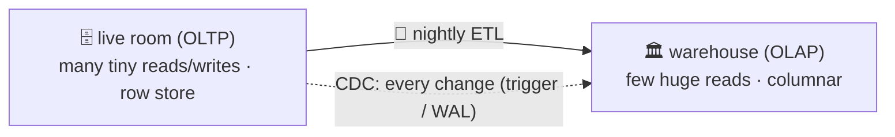

# 🏛️ Lesson 18 — OLTP vs OLAP: the office and the archive

**📍 You are here:** Lesson **18** of 18 — the final lesson! · Previous: `lesson-17-app-code`

> **Part 3 — going deeper.** Lessons 01–12 built and ran the record room. Lessons 13–18 are the
> topics interviews and incidents ask about — each one runs for real on the same `school.db`.

---

## 📦 What's in this branch

The complete course, plus `olap()` in [db/demo.py](../../db/demo.py): a monthly attendance
report run on the live 200,000-line table and on a summary table built by a "nightly ETL",
and a trigger that records every grade change in `grade_changes` (change data capture).

## 🧒 Explain like I'm 5

The school **office** is busy all day with tiny jobs: mark Sita present, fix Rohan's
grade, enrol Diya. That is **OLTP** — online *transaction* processing.

Once a year the head teacher asks a **huge** question: "attendance by month, for every
year since the school opened". If you ask the office, everyone stops working while the
clerks dig. So the school keeps an **archive** 🏛️ next door, built for huge questions,
filled every night from the office's records. That is **OLAP** — online *analytical*
processing, usually a **data warehouse**.

To keep the archive fresh without copying everything every night, the office keeps a
**change diary**: every time a grade changes, one line is written. The archive reads the
diary. That is **change data capture (CDC)**.

## 🗺️ Diagram



🗺️ Drawn version + a lab: [https://baluraut.github.io/learn-database-school/lesson-diagrams.html#l18](https://baluraut.github.io/learn-database-school/lesson-diagrams.html#l18)

## ❓ What

- **OLTP** — Postgres, MySQL, SQLite: rows stored together, indexes for point lookups, many
  small transactions.
- **OLAP** — BigQuery, Redshift, Snowflake, ClickHouse, DuckDB: **columnar** storage (a
  column's values stored together, compressed), built to scan and aggregate billions of rows.
- **ETL / ELT** — extract from the live room, transform, load into the warehouse, on a
  schedule. Summary tables (like `attendance_by_month`) are the simplest form.
- **CDC** — capture each change as it happens: a trigger writing to a change table (this
  demo), or reading the WAL (lesson 15) with tools like Debezium or AWS DMS.
- **Star schema** — the warehouse shape: a big **fact** table (attendance lines) surrounded
  by **dimension** tables (pupil, class, date).

## 🤔 Why

Heavy reports on the live room slow everyone else down, and dashboards love to refresh.
Moving them to a store built for them keeps the office fast and the reports cheap.

## 🔧 How (in this repo)

`olap()` in [db/demo.py](../../db/demo.py) times the report both ways, checks the answers
match, then creates the `cdc_grades` trigger and changes Rohan's maths grade.

## 🧪 Try it

```bash
python3 db/demo.py olap
python3 - <<'EOF'
import sqlite3
c = sqlite3.connect("db/school.db")
c.execute("UPDATE grades SET grade = 'A+' WHERE student_id = 2 AND subject = 'science'")   # same value: A+ → A+
c.execute("UPDATE grades SET grade = 'B+' WHERE student_id = 1 AND subject = 'maths'"); c.commit()
print(c.execute("SELECT grade_id, old, new FROM grade_changes").fetchall())
EOF
```

## ✅ Verify — what you should see

`report on the live 200,000-line table: ~29 ms · on the nightly summary (12 rows): ~0.08 ms`
(your numbers differ), `same answer: True`, and `(9, 'B', 'A')` in the change diary. In the
snippet, the trigger records both updates — it fires on every `UPDATE OF grade`, even one
that writes the same value.

## 🏁 What you just proved

You can say which questions belong in the office and which in the archive, and move a
report off the live room with a summary table and a change diary.

## ⚠️ Common mistakes

- dashboards that refresh every second against the production database
- editing rows in the warehouse — it is rebuilt from the source, not edited
- a nightly ETL nobody monitors (the report silently shows last week)
- "we need a warehouse" for a few thousand rows — one indexed query may be enough
- forgetting that CDC triggers add work to every write

> 🏭 **Why this matters in production:** most companies run Postgres/MySQL for the product
> and a warehouse for analytics, joined by ETL or CDC pipelines — data engineering starts here.

## 🎓 The record room is yours — all of it

Sticky notes → registers and keys → the archivist → the pencil ledger → one fact, one
place → the catalogue → two clerks → renovations → the fireproof copy → more rooms → on
call → **the locked register → rankings → the diary → copies of the room → the helper
with a box → the archive next door.** 🗄️🎓

```bash
git checkout main
python3 db/demo.py     # every lesson, 01–18, in one run
```
